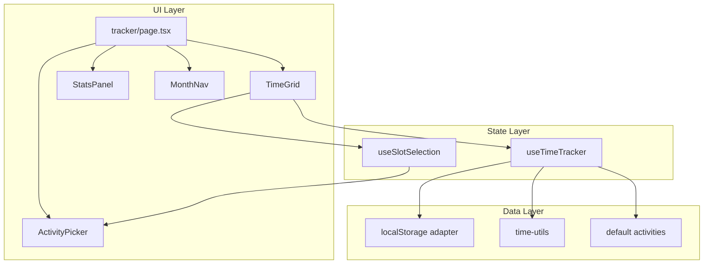

# Time Tracker — Implementation Plan

Pure-frontend time tracker: full-month 30-minute grid, emoji/color activities, localStorage persistence, desktop drag-select, and a basic stats panel. Work through phases in order; each task is sized for a ~30–60 minute session.

**Branch:** `feature/time-tracker`  
**Route (when built):** `src/app/tracker/page.tsx`

---

## Goals and constraints

- **Scope:** Full calendar month grid (days on X, 30-min slots on Y), matching your Excel mental model
- **Persistence:** `localStorage` only (no Convex yet)
- **Stack:** Next.js App Router, React 19 client components, Tailwind v4, existing `cn()` helper in `src/lib/utils.ts`
- **UI components:** shadcn/ui (configured but not yet installed — see below)
- **Session size:** Each task below is ~30–60 minutes and produces something visible or testable

## Architecture overview



**Core data shape (in memory + localStorage):**

```ts
type Activity = { id: string; emoji: string; label: string; color: string }

// Key: "2026-07-03:14" where 14 = slotIndex (0–47, each = 30 min)
type SlotMap = Record<string, string> // activityId

// localStorage key: "time-tracker:2026-07" → SlotMap JSON
```

No extra grid/selection libraries for v1. Desktop drag-select uses the **Pointer Events API** directly. shadcn components are added incrementally via the CLI as each phase needs them (Radix deps are pulled in automatically per component).

## shadcn/ui — current state and usage

**Already in the project:**

- `components.json` — shadcn configured (`new-york` style, `neutral` base, CSS variables, Lucide icons)
- `src/lib/utils.ts` — `cn()` helper (required by shadcn)
- `src/app/globals.css` — theme CSS variables compatible with shadcn
- `class-variance-authority`, `clsx`, `tailwind-merge`, `lucide-react` — already in `package.json`

**Not yet in the project:**

- No `src/components/ui/` folder — zero shadcn components installed so far
- Existing pages (`src/app/chat/page.tsx`, `src/app/page.tsx`) use plain HTML + Tailwind, not shadcn

**Rule for this feature:** Prefer shadcn for standard UI chrome (buttons, popovers, cards, sheets). Keep custom components (`TimeGrid`, `TimeCell`) as bespoke feature code — the grid itself is not a shadcn component.

**Install components only when a phase needs them** (keeps sessions small):

| Phase | Install via CLI            | Used for                                                        |
| ----- | -------------------------- | --------------------------------------------------------------- |
| 0     | `button`, `card`           | Page shell, layout wrappers                                     |
| 3     | `popover`, `command`       | ActivityPicker — searchable activity list in a popover          |
| 4     | `badge`                    | "Saving…" / "Saved" status indicator                            |
| 6     | (reuse `button`)           | MonthNav prev/next controls                                     |
| 7     | `separator`, `progress`    | StatsPanel dividers and hour bars                               |
| 8     | `sheet`, `scroll-area`     | Mobile activity toolbar (bottom sheet) + horizontal chip scroll |
| 9     | `dialog`, `input`, `label` | Custom activity editor (optional)                               |

Example install command (run once per session, only the components needed that session):

```bash
pnpm dlx shadcn@latest add button card
```

Custom grid cells (`TimeCell`) stay plain `<button>` or `<div>` elements with Tailwind — shadcn `Button` is too heavy for 1,400+ tiny cells.

## File layout (create incrementally)

```
src/
  app/tracker/page.tsx
  features/time-tracker/
    types.ts
    constants.ts
    lib/time-utils.ts
    lib/storage.ts
    hooks/use-time-tracker.ts
    hooks/use-slot-selection.ts
    components/time-grid.tsx
    components/time-cell.tsx
    components/activity-picker.tsx
    components/month-nav.tsx
    components/stats-panel.tsx
```

Keep all tracker logic under `src/features/time-tracker/` so a later Convex migration only swaps the storage adapter.

---

## Phase 0 — Branch and scaffold

### Task 0.1: Create feature branch

- `git checkout -b feature/time-tracker` (or stay on branch if already created)
- Verify `pnpm dev` still runs

**Done when:** Branch exists, dev server starts cleanly.

### Task 0.2: Install initial shadcn components

- Run `pnpm dlx shadcn@latest add button card`
- Verify `src/components/ui/button.tsx` and `src/components/ui/card.tsx` are created
- Confirm they import `cn` from `@/lib/utils` and match existing theme tokens in `globals.css`

**Done when:** shadcn Button and Card render correctly on a test page.

### Task 0.3: Add route shell

- Create `src/app/tracker/page.tsx` as a `"use client"` page
- Wrap content in shadcn `Card` (title + description); use `Button` for any nav actions
- Minimal layout: `max-w-full` container (grid will need width)
- Optional: add a link from `src/app/page.tsx` using shadcn `Button` variant `link`

**Done when:** `/tracker` loads in browser with shadcn-styled shell.

---

## Phase 1 — Domain model and time math

### Task 1.1: Types and default activities

- Add `src/features/time-tracker/types.ts`: `Activity`, `SlotKey`, `MonthKey`, `SlotMap`
- Add `src/features/time-tracker/constants.ts`:
  - `SLOTS_PER_DAY = 48`
  - `SLOT_MINUTES = 30`
  - ~8–12 seed activities (sleep, work, exercise, etc.) with emoji + hex/Tailwind-friendly colors

**Done when:** Types compile; activities are importable.

### Task 1.2: Time utility helpers

- Add `src/features/time-tracker/lib/time-utils.ts`:
  - `getDaysInMonth(year, month)` → array of `Date` objects
  - `toSlotKey(date, slotIndex)` → `"2026-07-03:14"`
  - `slotIndexToTimeLabel(slotIndex)` → `"07:00"`, `"07:30"`, …
  - `toMonthKey(year, month)` → `"2026-07"`
  - `parseSlotKey(key)` for stats

**Done when:** Unit-test manually in a temporary `console.log` or small dev snippet; remove before commit.

---

## Phase 2 — Static grid (no interaction)

### Task 2.1: TimeCell component

- Add `src/features/time-tracker/components/time-cell.tsx`
- Props: `activity?`, `isSelected?`, `onPointerDown?`
- Render: small square, background = activity color (or muted empty), centered emoji if filled
- Fixed size (~24–32px) for predictable drag math later

**Done when:** Story-like render in isolation on tracker page with hardcoded props.

### Task 2.2: TimeGrid — render full month

- Add `src/features/time-tracker/components/time-grid.tsx`
- Layout: CSS Grid
  - Column 0: sticky time labels (Y axis)
  - Columns 1–N: one per day in month
  - Row 0: day headers (date + weekday abbrev)
  - Rows 1–48: slot rows
- Wrap in `overflow-x-auto` for mobile horizontal scroll
- Sticky first column for time labels while scrolling horizontally

**Done when:** Current month renders 48 × days-in-month empty cells with correct labels.

---

## Phase 3 — Single-cell interaction (in-memory state)

### Task 3.1: useTimeTracker hook (memory only)

- Add `src/features/time-tracker/hooks/use-time-tracker.ts`
- State: `currentMonth`, `slots: SlotMap`, `activities` (from constants)
- Methods: `setSlot(key, activityId)`, `clearSlot(key)`, `getSlot(key)`
- Wire grid to hook; cells show assigned activities

**Done when:** Clicking a cell toggles a hardcoded activity (temporary) and grid updates.

### Task 3.2: Install shadcn picker components

- Run `pnpm dlx shadcn@latest add popover command`
- `Command` gives a searchable/filterable list — useful once you have many activities

### Task 3.3: ActivityPicker popover

- Add `src/features/time-tracker/components/activity-picker.tsx`
- Use shadcn `Popover` anchored near the selected cell (or centered on desktop)
- Inside: `Command` list of activities (emoji + label + color swatch as `CommandItem`)
- Include a **Clear** `CommandItem` (sets slot to empty)
- Flow: click cell → popover opens → pick activity → slot updates → popover closes

**Done when:** Single-cell assign and clear works end-to-end in memory.

---

## Phase 4 — localStorage persistence

### Task 4.1: Storage adapter

- Add `src/features/time-tracker/lib/storage.ts`:
  - `loadMonth(monthKey): SlotMap | null`
  - `saveMonth(monthKey, slots): void`
  - Guard `typeof window` for SSR safety

### Task 4.2: Wire hook to localStorage

- On mount: load month data into state (avoid hydration mismatch — start empty, load in `useEffect`)
- Debounced save (~300ms) on `slots` change

### Task 4.3: Save status indicator

- Run `pnpm dlx shadcn@latest add badge` (if not already installed)
- Show shadcn `Badge` with "Saving…" / "Saved" states driven by debounce hook

**Done when:** Fill cells, refresh page, data survives; save status visible.

---

## Phase 5 — Desktop drag-select

### Task 5.1: useSlotSelection hook

- Add `src/features/time-tracker/hooks/use-slot-selection.ts`
- Track: `anchorSlot`, `focusSlot`, `isSelecting`, `selectedKeys: Set<string>`
- Rectangle selection: given anchor + focus, compute all slot keys in the inclusive range (both day and slot dimensions)
- Visual: highlight selected cells with ring/border overlay

### Task 5.2: Pointer event wiring (desktop)

- `pointerdown` on cell → set anchor, start selection
- `pointermove` (with capture) → expand focus, update highlight
- `pointerup` → stop selection, open ActivityPicker if `selectedKeys.size > 0`
- Apply chosen activity to all keys in one `setSlots` batch
- Ignore drags shorter than ~4px (treat as click)

**Done when:** Click-drag across multiple cells → picker → all cells filled at once.

### Task 5.3: Keyboard modifier (optional polish)

- Shift+click extends selection from last anchor (nice-to-have, separate small session)

**Done when:** Power-user range select works on desktop.

---

## Phase 6 — Month navigation

### Task 6.1: MonthNav component

- Add `src/features/time-tracker/components/month-nav.tsx`
- shadcn `Button` variant `outline` with Lucide `ChevronLeft` / `ChevronRight` icons for prev/next
- Center label: `"July 2026"` (plain text or `Card` header)
- Changing month swaps `currentMonth`, loads that month's `SlotMap` from localStorage, re-renders grid

**Done when:** Navigate months; each month has independent saved data.

---

## Phase 7 — Stats dashboard

### Task 7.1: Install shadcn stats components

- Run `pnpm dlx shadcn@latest add separator progress`

### Task 7.2: StatsPanel — monthly totals

- Add `src/features/time-tracker/components/stats-panel.tsx`
- Wrap in shadcn `Card` with `CardHeader` / `CardContent`
- Compute from current month's `SlotMap`:
  - Count slots per activity × 0.5 hours
  - Sort by hours descending
  - Each row: emoji, label, hours, shadcn `Progress` bar for % of tracked time
  - `Separator` between summary sections
- Place above or beside grid (stack on mobile)

**Done when:** Filling grid updates stats live.

### Task 7.3: Untracked time summary (optional)

- Show count/hours of empty slots vs total slots in month using `Progress` + `Badge`
- Helps mirror your Excel "main page" rollup feel

**Done when:** You can see how much of the month is logged vs blank.

---

## Phase 8 — Mobile-friendly input (separate track)

Mobile drag-select conflicts with scroll. Defer to after desktop works; use a **paint-brush mode** instead of literal Excel drag.

### Task 8.1: Install mobile shadcn components

- Run `pnpm dlx shadcn@latest add sheet scroll-area`
- `Sheet` (side `bottom`) for expanded activity list on small screens
- `ScrollArea` for horizontal activity chip row

### Task 8.2: Activity toolbar (mobile)

- Fixed bottom bar: shadcn `ScrollArea` with activity chips (use `Badge` variant for active brush)
- `activeActivityId` state — tap chip to select "brush"
- Tap cell → fills with active activity; no popover needed for speed
- Optional: `Sheet` opens full activity list when "more" is tapped

### Task 8.3: Touch paint drag

- With brush active: `pointerdown` on cell starts painting; `pointermove` fills cells under finger
- Use `touch-action: none` on grid only while painting; otherwise allow scroll
- Long-press (~400ms) to enter paint mode as alternative entry

**Done when:** Usable on phone without fighting scroll.

---

## Phase 9 — Polish (pick off as needed)

Each item is its own small session:

| Task                  | Description                                                                            |
| --------------------- | -------------------------------------------------------------------------------------- |
| 9.1 Sticky header row | Day headers stay visible while scrolling vertically                                    |
| 9.2 Today highlight   | Column border/background for today's date                                              |
| 9.3 Undo last action  | Single-level undo stack in hook                                                        |
| 9.4 Export CSV        | Download month as CSV (day, time, activity)                                            |
| 9.5 Custom activities | shadcn `Dialog` + `Input` + `Label` to add/edit activities (separate localStorage key) |
| 9.6 Dark mode check   | Verify cell colors readable in dark theme via existing ThemeProvider                   |

---

## Suggested session order (minimum viable path)

```mermaid
gantt
  title MVP Session Sequence
  dateFormat X
  axisFormat %s

  section Foundation
  BranchAndRoute     :0, 1
  TypesAndUtils      :1, 2
  StaticGrid         :2, 3

  section Core UX
  InMemoryState      :3, 4
  ActivityPicker     :4, 5
  LocalStorage       :5, 6
  DragSelect         :6, 8

  section Complete
  MonthNav           :8, 9
  StatsPanel         :9, 10
  MobilePaint        :10, 12
```



**MVP checkpoint (sessions 0–7):** Full month grid, click + drag fill, localStorage, month nav, basic stats — usable on desktop daily.

**Mobile checkpoint (session 8):** Paint-brush mode for phone.

---

## Testing checklist (manual, each phase)

- Grid shows correct number of days for Feb vs March
- Slot 0 = 00:00, slot 47 = 23:30
- Single cell assign/clear works
- Refresh preserves data
- Drag-select fills rectangular region
- Month switch loads correct data; no cross-month bleed
- Stats hours = slot count × 0.5
- Mobile: can scroll grid horizontally; paint mode fills cells

---

## Future: Convex migration (out of scope for this plan)

When ready, replace `src/features/time-tracker/lib/storage.ts` with Convex queries/mutations using the same `SlotMap` shape. The UI layer (`TimeGrid`, hooks interface) should not need major changes if the hook exposes the same API.

Suggested Convex tables (later): `activities`, `timeBlocks` with `{ date, slotIndex, activityId }` and index `by_date`.

---

## Branch workflow

### Step 1 — Add the plan (done)

```bash
git checkout -b feature/time-tracker
git add implementation_plan.md
git commit -m "docs: add time tracker implementation plan"
```

### Step 2 — Build the feature (follow this document)

```bash
git checkout feature/time-tracker
# one phase per session, one commit per task when possible
# e.g. "feat(tracker): add static month grid"
```

Keep commits granular — one task ≈ one commit makes review and rollback easy during small sessions. Merge via PR when MVP checkpoint (Phases 0–7) is reached.
